Remote Working at Global Scale: Best Practices
###### STAY AT HOME | PULL DOLLARS | GET A LIFE

###### Pythonthusiast Remote Work Mentoring
http://pythonthusiast.com
---
Untuk Q&A selama dan setelah acara, silahkan bergabung ke media Whatsapp Group berikut ini:
[http://bit.ly/pythonthusiast-atmajaya](http://bit.ly/pythonthusiast-atmajaya)
---
Selama acara, voucher bootcamp remote work akan diberikan kepada 7 penanya pertama!
---
### Stephen R. Covey

---
### Seven Habits of Highly Effective People

- "Berapa banyak orang yang di ranjang kematiannya, mengharap untuk segera kembali ke kantor?" |
- "Don't put your ladder against the wrong wall" |

---

---
- Ada 7 prinsip, namun menurut saya yang paling utama adalah salah satu konsep mendasar dari prinsip *First Things First*|
- Manusia terdiri dari berbagai peran-peran (role),|
- dimana tiap peran memiliki tujuan (goal), |
- dimana kebahagiaan hanya tercapai jika tujuan dari peran tersebut terpenuhi, |
- yang dicapai dengan menjalankan misi (missions) dari peran-peran tersebut |

---
### Mengapa Anda mendatangi Bootcamp ini?

---
- Abraham Maslow's Hierarchy of Needs
- Intinya manusia melakukan segala sesuatu untuk mendapatkan kebahagiaan |

---
### Yaitu, Lebih dari sekedar Basic Need, jika Anda masih mampu, kejarlah Self-Actualization. Passion!
- Karena, tidak ada yang lebih mengasyikkan dari dibayar untuk sesuatu yang menjadi kesukaanmu|
- Different people, different passion |
- Identify your passion, and reach out to it |
- Conventional passion: guru, PNS, Tentara, Dokter, Arsitek, etc. |
---
- Millenial passion: Build the next killer application/startup |
- Mine? |
- Implementasi First Things First dari 7 Habits |

---
Rabu, 8 Maret 2017 - 4.45pm - GSP UGM

---
Jum'at, 7 Juli 2017 - 12.50pm - CGV Blitz, J-Walk

---
Senin, 17 Juli 2017 - 6.20am - Rumah

---
Can you spot what is so interesting from those pics?
- The date |
- The hour |
- It's working hour dudes! |

---
### It's Remote Work From Home!
- Work from home, not tied to an office |
- Kerja dari Rumah, Gaji dari Luar Negeri |
---
### WHAT ARE THE BENEFITS?
---
More time with family

Probably not so good for Jombloman

---
No traffic headache

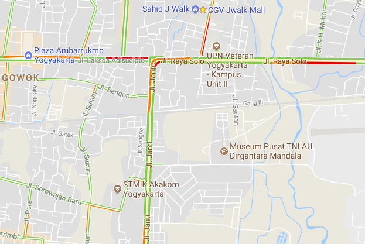

---
- No office politics
- Paid in USD.. so, $1500/month(*) is just under minimum |

---
Work everywhere: I mean it.
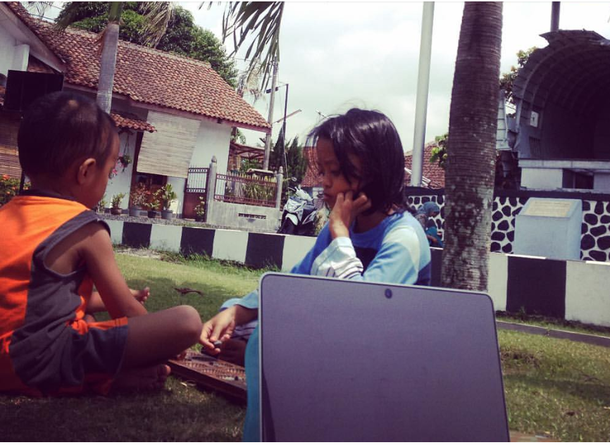

---
Or at home: built your own .. BatCave!
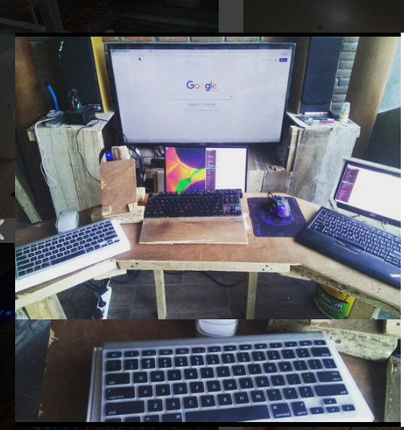

---
- If there are lots of time zone gaps, you’ll be blessed with so much freedom (Tidur siang anyone?)
- Suasana hidup? Pensiunan |
- You can fire your bosses |
- Bosses? Yes, you can work for many jobs at once |
- The trick? Delegate it! Build team! |
---
### WHAT DOES PAID IN USD MEANS?
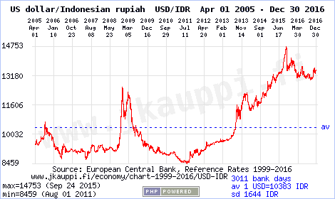

- 1 Unit penghargaan kerja dalam USD == 13.000 dalam IDR|
---
- Jika di Indonesia dalam sebulan Anda dihargai 5.000.000, maka itu berarti di Amerika Anda hanya dihargai 384,6 |
- Hargai waktu hidupmu! |
- Mau naik gaji ndak usah nuntut/demo macem-macem: tinggal tunggu dollar pas naik aja :) |
- Note: gaji startup terkini! |
---
### WHAT IF???
- Anda bisa bekerja dari Indonesia, namun mendapat gaji dalam USD? Paid in USD, spent in IDR!|
- Why? Karena kerja di luar negeri dengan cara pindah ke luar negeri.. kinda useless |

---
### WE ARE ... TKI 2.0!

- Yeaaah!!! |
- Note about big company closing theif offline offices |
---
### WHAT ARE THE DISADVANTAGES?
- Jomblo will probably stay jomblo (just kidding)|
- No bona fide office |
- If you don’t plan it well, you may not have social life |
- Often, it’s hard to remember: which day today? |
- Rather difficult to explain it in laymen term |
- Careful, socialize with your neighborhood: or they may suspicious of what you actually do |

---
### PLUS VALUES IF YOU ARE A DAD
You can become .. SuperDad!
- Jika Anda muslim, mudahnya mendidik anak lanang sholat jama’ah ke masjid|
- Sholat Jum’at? Tiap jum’at bisa eksplore masjid-masjid baru. Atau tarawih dimana saja |
- Bisa bareng menekuni beladiri rutin, 2-3x seminggu |
- Bisa day-to-day amati, arahkan dan perbaiki perkembangan anak |
- Overall? Dari sudut pandang pribadi: kebahagiaan yang hakiki :) |

---
### CHALLENGE TO START FREELANCING JOB I: Freedom
- Hear what Loki said about freedom |

- Do you agree with Loki? |

---
### CHALLENGE TO START FREELANCING JOB II: Time management
- How to work 8 hour / day from home? |
- Bagi waktu kerja / belajar dalam chunk 2 jam, dan selingi dengan beragam aktivitas kehidupanmu |
- It need years of practice, so don't give up! |

---
### CHALLENGE TO START FREELANCING JOB III: English communication skills
- Reading, writing and speaking in English |
- Tips: nonton film Bahasa Inggris: tanpa subtitle atau dengan subtitle Bahasa Inggris |

---
### FREELANCER LEVELS
- Freelancer achak-adhut |
- Freelancer online |
- Remote Long Term Employee |
---
### Extra Levels
- Build a team, delegate to your staffs. Startup. |
- Ads Publisher: AdSense, AdMobs, etc |
---

---
### Apapun itu, jangan mengulangi kesalahan Rachel berikut ini
Friends Season 3 Episode 10: The One Where Rachel Quits

Hear, hear, hear y'all!

---
### BEFORE GOING ANY FURTHER
Cara mendapatkan dollar dari luar negeri itu _terlalu_ banyak caranya.
Freelancer challenge: "BAGAIMANA PERUSAHAAN LUAR NEGERI MAU MEMPERCAYAI ANDA PADA PEKERJAAN-PEKERJAAN YANG DISEDIAKANNYA"

---
### OKAY, HOW DO I START REMOTE WORK?
REMEMBER THESE 10 MANTRA

---
- UPGRADE SKILL|
- PERSONAL BRANDING |
- PERSONAL BRANDING |
- PERSONAL BRANDING |
- PERSONAL BRANDING |
- PERSONAL BRANDING |
- PERSONAL BRANDING |
- PERSONAL BRANDING |
- PERSONAL BRANDING |
- PERSONAL BRANDING |

---
### WHY THE FOCUS ON PERSONAL BRANDING?
Salah satu kisah pada buku Seni Berperang Sun-Tzu: "Pasukan yang berjumlah kecil berhasil membuat musuh yang jauh lebih kuat ketakutan, karena menyangka pasukan yang kecil tersebut bejumlah jauh lebih besar dari kekuatannya".
How?
---
### FONDASI UTAMA MEREBUT JOB REMOTE!

---
Halo Effect!
---
What's that?
Mari kita simak referensi intelek dan berbobot berikut ini
---

---
- Diungkapkan pertama kali oleh psikolog Edward Thorndike
- Adalah pengaruh pesona pada satu area yang mempengaruhi penilaian pada area yang lain|
- Bagaimana membuat employer dari UK/US/Kanada bisa percaya dan tertarik dengan kemampuanmu? |
---
- Pencitraan
- Aktif di Sosial media secara positif: share tentang coding tips and tricks, bukan tentang .. Bu Dendy|
---
### TO BE EXACT: "PENCITRAAN 2.0"
Be wise with what you share in your social media account

- Blog your learning experience, but don’t look like you are learning. Make it look like you are teaching. And yes, in English please|
- For programmer, active in StackOverflow either asking or answering. |
- For programmer, commit your code in Github. For designer, show case your design in dribble.com, deviantart.com, etc. |

---

### PERFECT USE OF SOCIAL MEDIA!
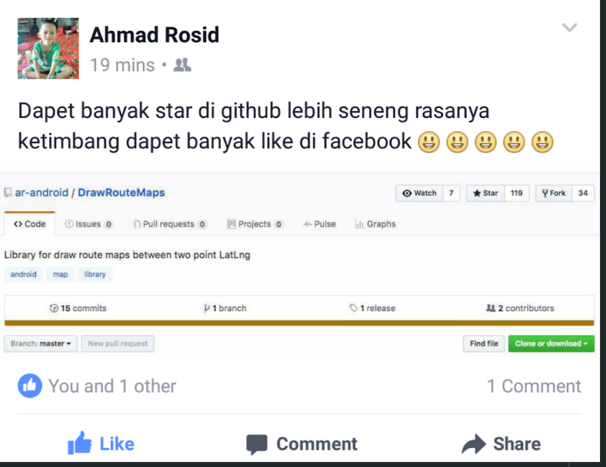

---
Check that posts:
- Github portfolio, opensource project means recognized in OSS world, star and f**k number!|
- Memotivasi audience! |
- No hate speech, politics: means, audience luas sekali. |
- Hats off!!! |

---
### Apa bedanya pencitraan dengan pamer?
- Luruskan niat: self branding |
- Pada akhirnya: biarkan orang lain berbicara |

---
- Daftar ke upwork.com, atau hunt job di remoteok.io |
- Saat mengirim cover letter untuk job yang kamu rasa cocok, gunakan link ke medium/domain-mu sebagai salah satu portofolio |
- That's it! |
---

### NOTABLE WORK HISTORY
- Gamatechno |
- Konsultan Skripsi |
- Gameloft |
- Upwork |
- SaleStock |
- Remoteok.io |
- MonetizeMore.com |

---
### NOTABLE REMOTE CLIENT WORK HISTORY

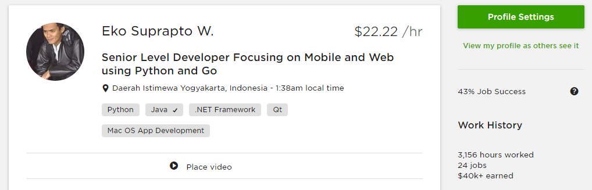
---
First Client

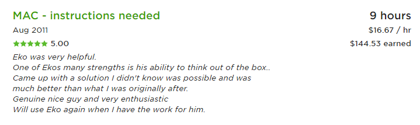

---

Box.com (Australia) - iOS | Sam Rowe (Australia) - C# | MeetingBurner (US) - Java |

Pythonblogs (US) - Python | ForexSecure.net - Python | MonetizeMore.com - Python |

Full list ?

http://bit.ly/swdev-cv
---

### WHY PYTHON?

- Easy to understand!
- Prove?
---
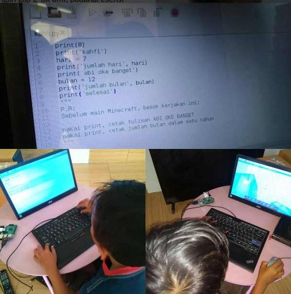

---
- Top most programming Language of 2017 |
- Readily available in all platform: desktop, mobile or web |
- Industry standard: due to its cross platform nature, you can find API access example using Python: Google, Facebook, Amazon, etc. |
- Desktop: PyQt, WxPython, Kivy |
- Web: Django, Flask, Pylons/Pyramid |
- Mobile: Kivy, PyGame Subset for Android (ps4a) |
- BigData: numpy, scipy |
- Networking: Tornado, Twisted |

---
### POPULAR WEBSITE BUILT WITH PYTHON

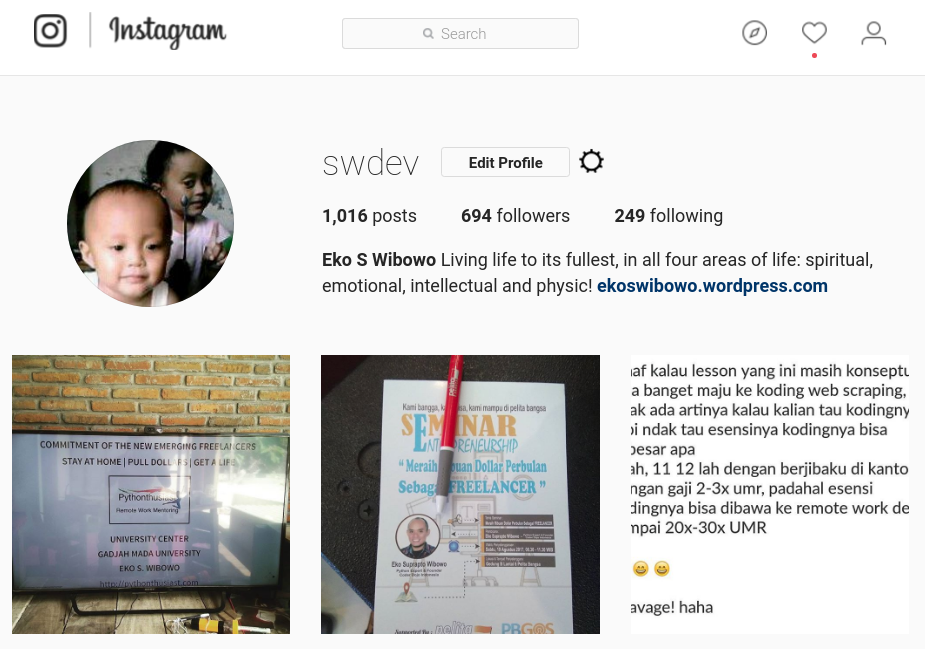
---

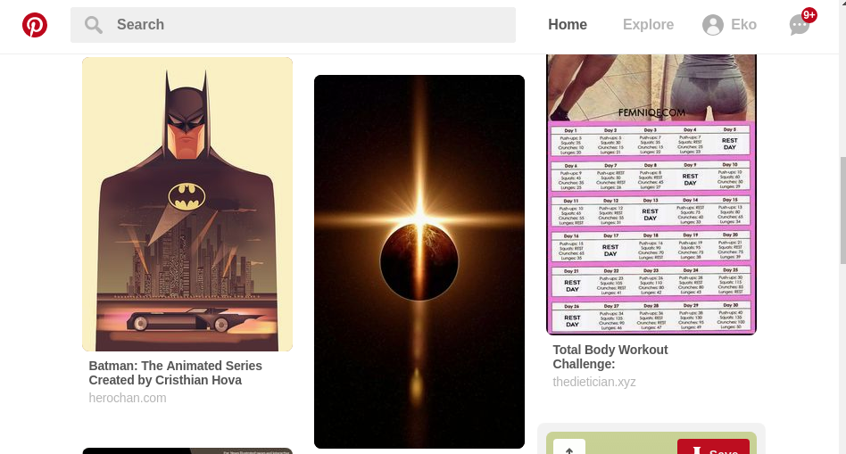
---

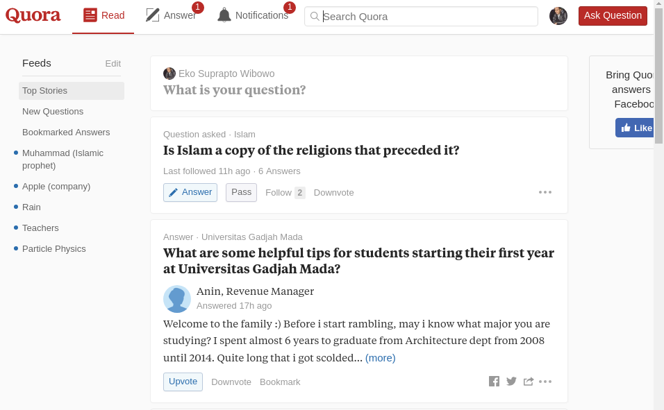
---
### Final note?

http://pythonthusiast.com

---
What is pythonthusiast.com?

---
- Inspired by CoderDojo.com movement
- Remote work mentoring to its fullest! |
- One time paymnent, lifetime support!|
- Intensive 3 Days Bootcamp with low price investment|
- Community of motivated remote worker wannabe |
---
- English corner
- Slack channel communication or private chat |
---
### THANKS GUYS, AND ...
---
Good bye!
---
Presented in Coder Dojo Indonesia , Yogyakarta, 27 Juli 2018

###### Eko S. Wibowo | 081-2222-1975 | facebook.com/swdev
http://pythonthusiast.com
---
### UPWORK EARNING HISTORY

---

---

---

---

---

---

---

---
### Full portfolio
http://bit.ly/swdev-cv
That's it!
---
