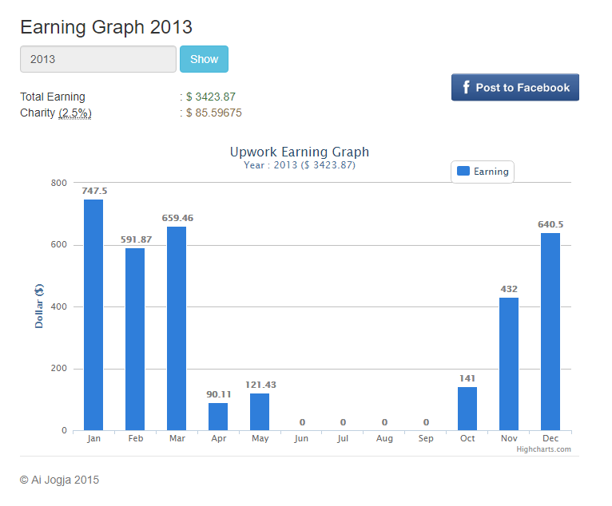

Mencapai Keseimbangan Hidup dengan Remote Work
dan Penerapan "7 Habits of Highly Effective People"
###### STAY AT HOME | PULL DOLLARS | GET A LIFE 

###### CoderDojo Indonesia
http://pythonthusiast.com
---
### Stephen R. Covey

---
### QUOTE UTAMA
Stephen R. Covey - Seven Habits of Highly Effective People

- "Berapa banyak orang yang di ranjang kematiannya, mengharap untuk segera kembali ke kantor?" |
- "Don't put your ladder against the wrong wall" |

---
### APA ITU 7 HABITS OF HIGHLY EFFECTIVE PEOPLE?
- Cara menjalani kehidupan yang berbasis pada prinsip-prinsip orang-orang yang sangat efektif |
- Pertama kali dipublikasikan oleh Dr Stephen R. Covey pada tahun 1989 |

---
- "Salah satu buku paling menginspirasi dan berpengaruh yang pernah ditulis. Telah memikat para pembacanya selama 25 tahun. Buku ini mengubah kehidupan para presiden direktur dan CEO, tokoh pendidik dan orangtua --singkatnya, jutaan orang dari segala usia dan pekerjaan" |
- Kevin Turner (COO Microsoft Corp.), Mitt Romney (Gubernur Massachusets), Ariana Huffington (Presiden Direktur Huffington Post), Arwin Rasyid (Presiden Direktur CIMB Niaga), Dara Tores (Peraih Medali Emas Olimpiade), Mohammad Yunus (Peraih Hadiah Nobel Perdamaian 2006) |

---
### APA SAJA 7 HABITS ITU?
Ketujuh habits / kebiasaan ini terbagi kedalam tiga kategori utama:
- Kemenangan Pribadi |
- Kemenangan Publik |
- "Sharpen The Saw" |

---
### SEBELUM LEBIH JAUH TENTANG 7 HABITS
Perhatikan gambar dibawah ini

---
### IT'S ALL ABOUT YOUR PASSION
- Different people, different passion |
- Identify your passion, and reach out to it |
- Conventional passion: Guru/dosen, PNS, Tentara, Dokter, etc. |
- Millenial passion: Build the next killer startup |
- Mine? |

---
Rabu, 8 Maret 2017 - 4.45pm - GSP UGM

---
Jum'at, 7 Juli 2017 - 12.50pm - CGV Blitz, J-Walk

---
Senin, 17 Juli 2017 - 6.20am - Rumah

---
Can you spot what is so interesting from those pics?
- The date |
- The hour |
- It's working hour! |

---
### FREELANCER LEVELS
- Freelancer achak-adhut |
- Freelancer online |
- Remote Long Term Employee |

---
### Extra Levels
- Build a team, delegate to your staffs. Startup. |
- Ads Publisher. Can also be startup. |

---

---
### BACKGROUND CHECK: DIFFERENT STRATEGY
Strategi memulai perjalanan sebagai freelamcer akan berbeda: persiapan, eksekusi dan evaluasi
- Pelajar |
- Mahasiswa |
- Pekerja serabutan |
- Pekerja kantor |

---
### WHAT ARE THE BENEFITS?

---
More time with family

Probably not so good for Jombloman

---
No traffic headache 

---
- No office politics |
- Paid in USD.. so, $1500/month(*) is just under minimum | 

---
Work everywhere: I mean, anywhere!

---
Or at home: built your own .. BatCave!

---
- You can fire your boss(es) |
- If there are lots of time zone gaps, you’ll be blessed with so much freedom (Tidur siang anyone?) |
- Suasana hidup? Pensiunan |

---
### Pursue life. Get a life! 
Belajar bertukang

---
Cosplayer? Yeaah, maybe.. :D

---
Or, just stupid things! 

---
### WHAT ARE THE DISADVANTAGES?
- Jomblo will probably stay jomblo (just kidding)|
- No bona fide office |
- If you don’t plan it well, you may not have social life |
- Often, it’s hard to remember: which day today? |
- Rather difficult to explain it in laymen term |
- Careful, socialize with your neighborhood: or they may suspicious of what you actually do |

---
### PLUS VALUES IF YOU ARE A DAD
You can become .. SuperDad!
- Jika Anda muslim, mudahnya mendidik anak lanang sholat jama’ah ke masjid|
- Sholat Jum’at? Tiap jum’at bisa eksplore masjid-masjid baru |
- Bisa bareng menekuni beladiri rutin, 2-3x seminggu |
- Bisa day-to-day amati, arahkan dan perbaiki perkembangan anak |
- Overall? Dari sudut pandang pribadi: kebahagiaan yang hakiki :) |

---
### CHALLENGE TO START FREELANCING JOB I: Freedom
- Hear what Loki said about freedom |

- Do you agree with Loki? | 

---
### CHALLENGE TO START FREELANCING JOB II: Time management
- How to work 8 hour / day from home? |
- Bagi waktu kerja / belajar dalam chunk 2 jam, dan selingi dengan beragam aktivitas kehidupanmu |
- It need years of practice, so don't give up! |

---
### CHALLENGE TO START FREELANCING JOB III: English communication skills
- Reading, writing and speaking in English |
- Tips: nonton film Bahasa Inggris: tanpa subtitle atau dengan subtitle Bahasa Inggris |

---
### LET'S NOT REPEAT RACHEL MISTAKES!
Friends Season 3 Episode 10: The One Where Rachel Quits

Hear, hear, hear y'all!

---
### WHAT DOES PAID IN USD MEANS?

- 1 Unit penghargaan kerja dalam USD == 13.000 dalam IDR|
---
- Jika di Indonesia dalam sebulan Anda dihargai 5.000.000, maka itu berarti di Amerika Anda hanya dihargai 384,6 |
- Hargai waktu kerjamu! |
- Mau naik gaji ndak usah nuntut/demo macem-macem: tinggal tunggu dollar pas naik aja :) |
- Note: gaji startup terkini! |

---
### WHAT IF???
- Anda bisa bekerja dari Indonesia, namun mendapat gaji dalam USD? Paid in USD, spent in IDR!|
- Why? Karena kerja di luar negeri dengan cara pindah ke luar negeri.. kinda useless |

---
### WE ARE ... TKI 2.0!

- Yeaaah!!! |
- Note about big company closing theif offline offices |

---
### BEFORE GOING ANY FURTHER
Cara mendapatkan dollar dari luar negeri itu _terlalu_ banyak caranya.
Freelancer challenge: "BAGAIMANA PERUSAHAAN LUAR NEGERI MAU MEMPERCAYAI ANDA PADA PEKERJAAN-PEKERJAAN YANG DISEDIAKANNYA"

---
### OKAY, HOW DO I START REMOTE WORK?
REMEMBER THESE 10 MANTRA

---
- UPGRADE SKILL|
- PERSONAL BRANDING |
- PERSONAL BRANDING |
- PERSONAL BRANDING |
- PERSONAL BRANDING |
- PERSONAL BRANDING |
- PERSONAL BRANDING |
- PERSONAL BRANDING |
- PERSONAL BRANDING |
- PERSONAL BRANDING |

---
### WHY THE FOCUS ON PERSONAL BRANDING?
Salah satu kisah pada buku Seni Berperang Sun-Tzu: "Pasukan yang berjumlah kecil berhasil membuat musuh yang jauh lebih kuat ketakutan, karena menyangka pasukan yang kecil tersebut bejumlah jauh lebih besar dari kekuatannya".
How?

---
### PENCITRAAN

---
### TO BE EXACT: "PENCITRAAN 2.0"
Be wise with what you share in your social media account

- Blog your learning experience, but don’t look like you are learning. Make it look like you are teaching. And yes, in English please|
- For programmer, active in StackOverflow either asking or answering. |
- For programmer, commit your code in Github. For designer, show case your design in dribble.com, deviantart.com, etc. |

---

### PERFECT USE OF SOCIAL MEDIA!

---
Check that posts:
- Github portfolio, opensource project means recognized in OSS world, star and f**k number!|
- Memotivasi audience! |
- No hate speech, politics: means, audience luas sekali. |
- Hats off!!! |

---
### Apa bedanya pencitraan dengan pamer?
- Luruskan niat: self branding |
- Pada akhirnya: biarkan orang lain berbicara |

---
### NOTABLE WORK HISTORY
- Gamatechno |
- Konsultan Skripsi |
- Gameloft |
- Upwork |
- SaleStock |
- Remoteok.io |
- MonetizeMore.com |

---
### NOTABLE REMOTE CLIENT WORK HISTORY

---
First Client

---

Box.com (Australia) - iOS | Sam Rowe (Australia) - C# | MeetingBurner (US) - Java |
 
Pythonblogs (US) - Python | ForexSecure.net - Python | MonetizeMore.com - Python |
 
Full list ? 

http://bit.ly/swdev-cv

---
### Startup started as Freelancer

- Krafthaus - Arief Widyananda - Former Gameloft |
- Skyshi - Rizqinofa Putra - Former Drupal freelancer |

---

### WHY PYTHON?

- Easy to understand!
- Prove?
---

---
- Top most programming Language of 2017 |
- Readily available in all platform: desktop, mobile or web |
- Industry standard: due to its cross platform nature, you can find API access example using Python: Google, Facebook, Amazon, etc. |
- Desktop: PyQt, WxPython, Kivy |
- Web: Django, Flask, Pylons/Pyramid |
- Mobile: Kivy, PyGame Subset for Android (ps4a) |
- BigData: numpy, scipy |
- Networking: Tornado, Twisted |

---
### POPULAR WEBSITE BUILT WITH PYTHON

---

---

---
### UPWORK EARNING HISTORY

---

---

---

---

---

---

---

---

---
### Final note?

http://pythonthusiast.com

---
What is pythonthusiast.com?
- Inspired by CoderDojo.com movement |
- Remote work mentoring to its fullest! |
- One time paymnent, lifetime access|
- Community of motivated remote worker wannabe |

---
- English corner |
- Slack channel communication or private chat |

---
### THANKS GUYS, AND ...
---

- Ping me for Questions regarding remote work. |
- I'll be more than happy to help. |
- That's my passion! |
- Keep up! |

---
Presented in Yogyakarta, 25 Agustus 2017

###### ESPAY.ID
###### OAK CAFE - YOGYAKARTA
###### Eko S. Wibowo | 081-2222-1975
http://pythonthusiast.com